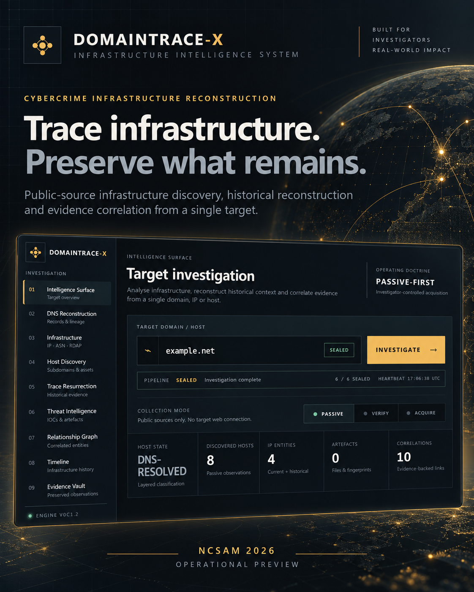
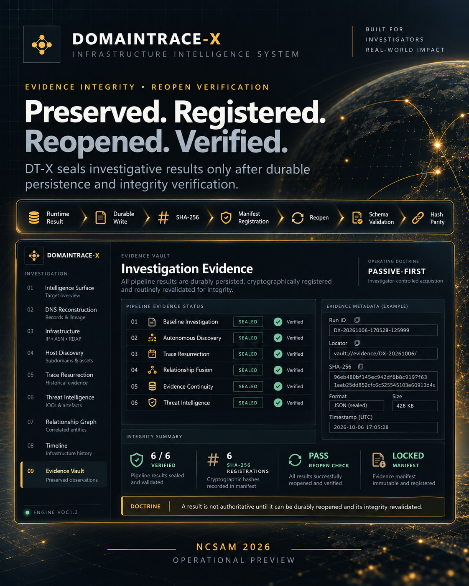
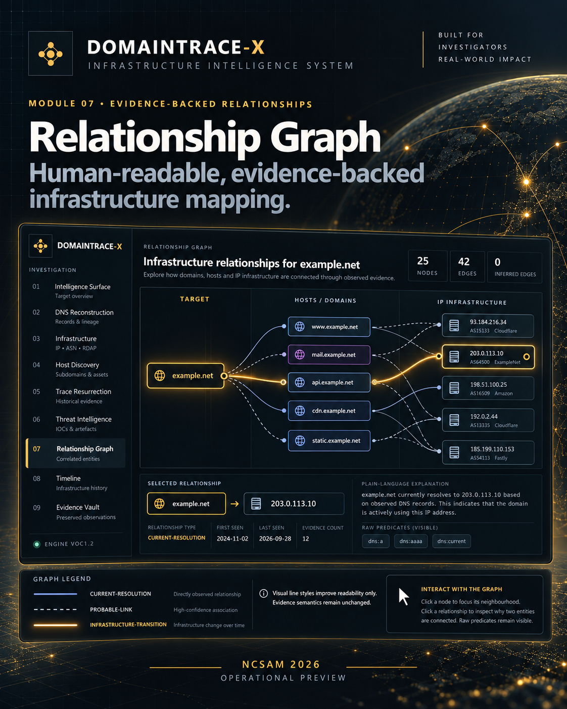

# DOMAINTRACE-X

## Cybercrime Infrastructure Reconstruction

**Trace infrastructure. Preserve what remains.**

**Release:** NCSAM 2026 RC1 / Operational Preview  
**Creator:** Indranil Mondal  
**Operating doctrine:** PASSIVE-FIRST  
**Repository type:** Public project showcase / documentation only

---

## What is DOMAINTRACE-X?

**DOMAINTRACE-X (DT-X)** is an evidence-led cybercrime infrastructure reconstruction platform conceived to reduce the fragmentation involved in investigating suspicious domains, hosts and related infrastructure.

Cybercrime infrastructure is often transient. DNS records change. Hosting moves. Endpoints disappear. Malicious delivery paths go offline. Historical observations become scattered across independent public sources.

DT-X is designed around a simple investigative objective:

> **Give the system one target and reconstruct the evidence-backed infrastructure story around it — while preserving what can still be verified.**

DT-X brings public-source infrastructure discovery, historical reconstruction, threat-intelligence correlation, relationship analysis and evidence preservation into a single investigator-oriented workflow.

---

## Why DT-X exists

Traditional infrastructure investigations frequently require investigators to move between multiple independent tools for:

- DNS and infrastructure intelligence
- host and subdomain discovery
- IPv4 / IPv6 analysis
- historical observations
- threat-intelligence sources
- relationship correlation
- timeline reconstruction
- evidence preservation

DT-X was created to bring those fragments together while maintaining a strict separation between **discovery, correlation and attribution**.

### Core doctrine

> **DISCOVERY ≠ ATTRIBUTION**

A shared IP does not automatically establish common ownership.  
A historical observation does not establish present activity.  
Visual proximity does not establish a relationship.  
Absence of an observation is not converted into a fabricated conclusion.

---

## Backend-owned investigation lifecycle

The current DT-X pipeline consists of six evidence-producing stages:

1. **Baseline Investigation**
2. **Autonomous Discovery**
3. **Trace Resurrection**
4. **Relationship Fusion**
5. **Evidence Continuity**
6. **Threat Intelligence**

The investigation lifecycle is backend-controlled rather than browser-owned, allowing authoritative processing to continue independently of a browser session.

---

## Investigator views

Preserved results can be examined through dedicated investigator-oriented views:

- **DNS Reconstruction**
- **Infrastructure Intelligence**
- **Host Discovery**
- **Trace Resurrection**
- **Threat Intelligence**
- **Relationship Graph**
- **Timeline**
- **Evidence Vault**

---

## Evidence lifecycle

A DT-X producer is not considered successfully sealed merely because its execution returned successfully.

Its result must pass through an evidence lifecycle:

**Result → Durable Write → SHA-256 → Registration → Reopen → Schema Validation → Hash-Parity Verification**

The governing principle is:

> **If evidence cannot be durably preserved, reopened and integrity-verified, the platform must not represent that evidence as successfully sealed.**

---

## Evidence-backed Relationship Graph

DT-X includes a human-readable, clickable Relationship Graph designed to help investigators understand **why** two preserved entities are connected.

The current graph presentation supports:

- target-centered semantic lanes
- entity and relationship focus
- plain-language relationship explanation
- preservation of raw relationship predicates
- explicit distinction between observed and inferred meaning
- visual decluttering without removing underlying evidence

In the accepted NCSAM 2026 RC1 validation case, the graph reopened a preserved result containing:

- **25 persisted entities**
- **42 explicit relationships**
- **0 inferred edges**

Visual layout is a presentation aid only and has **zero evidentiary meaning**.

---

## PASSIVE-FIRST

DOMAINTRACE-X is designed around a **PASSIVE-FIRST** operating doctrine.

Its purpose is lawful public-source infrastructure intelligence, historical reconstruction, evidence correlation and preservation for cybersecurity research and cybercrime investigation.

DT-X is not presented as an exploitation or offensive-access framework.

---

## Current release status

**DOMAINTRACE-X — NCSAM 2026 RC1 / Operational Preview**

The current release has validated:

- backend-owned six-stage investigation lifecycle
- durable evidence persistence
- SHA-256 evidence registration
- reopen verification and hash parity
- dependency blocking
- read-only derived views
- IPv4 / IPv6 infrastructure handling
- evidence-backed relationship reconstruction
- clickable, investigator-readable relationship graph
- explicit zero-result semantics for historical evidence
- evidence-vault integrity presentation

Historical-source enrichment and broader validation will continue as the platform evolves.

---

## Public-release boundary

This repository is intentionally **documentation-only**.

It does **not** publish:

- production source code
- operational collector logic
- service credentials
- API keys or tokens
- production deployment configuration
- internal database contents
- live investigative case material
- internal evidence paths
- provider-specific acquisition logic

The purpose of this repository is to establish a public technical overview of the project without exposing sensitive implementation details or operational investigation data.

---

## Visual disclosure

The launch visuals in this repository are **illustrative interface visualizations based on live DOMAINTRACE-X capabilities and verified operational results**.

They are intended to communicate the product architecture and investigator experience. They should not be interpreted as literal screenshots of every current production view.

---

## NCSAM 2026

DOMAINTRACE-X RC1 is being introduced during **National Cyber Security Awareness Month 2026** as an **Operational Preview**.

**Conceived in India.  
Built for investigation.  
Designed around evidence.**

### Trace infrastructure. Preserve what remains.

---

## Creator

**Indranil Mondal**  
Cybercrime Investigator | Cybersecurity Researcher  
Cyber Ambassador — ISEA Programme, C-DAC / MeitY

---

## Status and rights

DOMAINTRACE-X remains under active development.

This public repository is a documentation and project-showcase repository only. No source-code license or permission to reproduce the underlying proprietary implementation is granted by publication of these materials.

**© 2026 Indranil Mondal. All rights reserved.**
